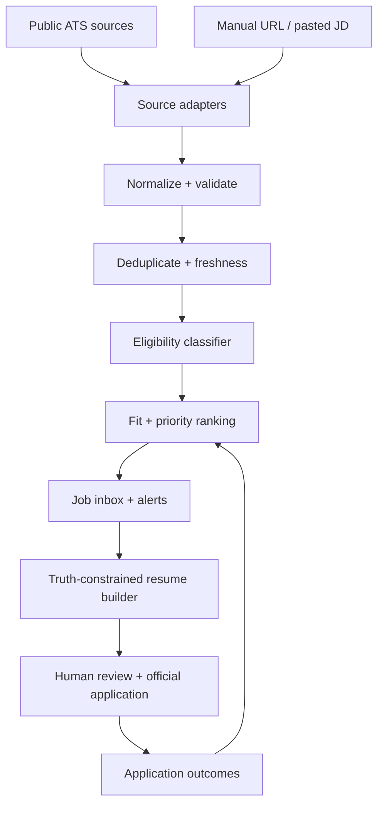

# SWETrack Job Radar — Architecture and Claude Code Build Handoff

## 1. Mission

Extend the existing SWETrack/RoleRank repository into a zero-additional-cost recruiting system that:

1. Finds newly published U.S. new-grad software engineering roles throughout the day.
2. Filters out senior, internship-only, non-SWE, stale, duplicate, and ineligible roles.
3. Ranks jobs for Subham Das using freshness, hard eligibility, Role Fit, preferences, and confidence.
4. Alerts the user quickly and sends them to the employer's official application page.
5. Produces a truthful, one-page, ATS-friendly tailored resume and a concise match report for a selected job.
6. Tracks review, application, interview, rejection, and offer outcomes inside SWETrack.

This is a decision-support and document-preparation app, not an auto-apply bot. The user must review every resume and submit every application.

## 2. Non-negotiable constraints

- Total additional spend: **$0**.
- Use no paid LLM API, cloud database, scraping proxy, CAPTCHA solver, or paid job-data provider.
- ChatGPT Plus does not supply OpenAI API credits. ChatGPT is therefore an interactive review surface, not an unattended backend.
- Claude Pro may be used through Claude Code within plan limits. Continuous discovery must not depend on LLM availability or consume Claude usage all day.
- The core discovery, filtering, deduplication, scoring, keyword analysis, and resume assembly must work locally without an LLM.
- Preserve the existing modular-monolith direction: Python 3.11, FastAPI, SQLAlchemy, SQLite locally, React, pytest, Docker, Sentence Transformers, and local MLflow where already present.
- Keep **Role Fit**, **Readiness**, and **Application Priority** as separate explainable values.
- Preserve a one-page LaTeX resume and ATS-simple formatting.
- Never invent, exaggerate, or infer candidate experience. A job-description keyword may be inserted only when supported by an approved evidence item.
- Do not automate applications, demographic answers, legal attestations, work-authorization answers, or CAPTCHA handling.
- Do not scrape LinkedIn, Indeed, Handshake, or other authenticated/anti-bot sites.
- Honor robots.txt, site terms, rate limits, and source-specific backoff. Prefer documented public job-board endpoints.
- Claude Code must work in small checkpoints, show test results, propose a commit message, and stop for the user to review and commit. Never commit or push.

## 3. Candidate profile to seed

Create editable configuration rather than hard-coding these facts:

```yaml
candidate:
  name: Subham Das
  graduation_date: 2026-05
  degree: B.S. Computer Sciences
  school: University of Wisconsin-Madison
  work_authorization:
    country: US
    sponsorship_required: false
  target_roles:
    - Software Engineer
    - Software Developer
    - Backend Engineer
    - Full-Stack Engineer
    - Product Software Engineer
    - Cloud Engineer
    - Platform Engineer
  secondary_roles:
    - AI Software Engineer
    - ML Platform Engineer
  excluded_levels:
    - Senior
    - Staff
    - Principal
    - Manager
    - Director
    - Lead
  preferred_locations:
    - New York City
    - New Jersey
    - Chicago
  accepts_other_us_locations: true
  accepts_remote_us: true
```

Seed approved experience evidence from the current master resume, including:

- AWS TrackPoint: Java, Lambda, API Gateway, DynamoDB, DynamoDB Streams, CloudWatch, REST/RPC services, versioned data, audit history, 500K+ annual workflows, 100+ attributes, 80% reporting reduction, 100+ hours/week saved where currently supported by the resume.
- Johnson & Johnson: Python, SQL, Power BI, Excel, Selenium/BeautifulSoup, data catalogs, automation, verified cost avoidance, and documented time/cost impact.
- Capital One Capstone: full-stack fraud detection, Random Forest, 1M+ simulated transactions, 99.3%+ measured accuracy, AWS backend, configurable alerts.
- SWETrack: FastAPI, React, SQLAlchemy/PostgreSQL or SQLite according to actual current state, Docker, pytest, Sentence Transformers, TF-IDF, cosine similarity, Precision@K, NDCG@K, and MLflow according to actual current state.

The repository audit is authoritative. Do not claim planned features as completed features in generated resumes.

## 4. Product boundaries

### In scope

- Public company ATS feeds and explicitly allowed public career pages.
- A configurable target-company registry.
- New-grad classification and graduation-window detection.
- First-seen and source timestamp tracking.
- Cross-source deduplication.
- Explainable matching and prioritization.
- Local/browser dashboard and macOS notifications.
- Manual URL or pasted-JD import.
- Truth-constrained resume selection, reordering, keyword substitution, LaTeX rendering, and PDF validation.
- Ready-to-paste prompt packets for ChatGPT or Claude.
- Optional user-triggered Claude Code CLI assistance, isolated behind an adapter.
- Application tracking and outcome feedback.

### Out of scope for the first release

- One-click or bulk auto-apply.
- Browser automation on third-party application forms.
- Paid APIs or LLM calls.
- Generating unsupported skills, metrics, titles, dates, or responsibilities.
- A microservice architecture, Kubernetes, Redis, Kafka, or a vector database.
- Training a new ML model before enough labeled user outcomes exist.
- Claiming that a numeric score predicts hiring or guarantees ATS passage.

## 5. System architecture



Use a modular monolith. Source adapters implement one interface; domain services remain independent of FastAPI, React, scheduling, and persistence.

### Two execution planes

**Private local plane (required):**

- Stores resume facts, candidate preferences, job decisions, and applications.
- Runs role matching and resume generation.
- Uses SQLite and local filesystem.
- Exposes FastAPI endpoints to the React UI.
- Can poll while the Mac is awake using a LaunchAgent or a user-invoked CLI command.

**Always-on discovery plane (optional after local MVP):**

- Runs only public-data discovery and generic new-grad classification in GitHub Actions.
- Contains no resume, candidate history, private profile, generated resumes, or secrets.
- Publishes a small public `latest_jobs.json` feed or creates a GitHub notification issue when genuinely new roles appear.
- The local app imports that feed and performs personalized scoring privately.
- Use standard Linux runners only. Configure a strict repository/action spending limit and keep the workflow small.

The application must remain fully useful without the always-on plane.

## 6. Job-source strategy

### Tier 1: documented public ATS endpoints

Implement these first:

1. **Greenhouse Job Board API**
   - Board registry contains company name and board token.
   - `GET https://boards-api.greenhouse.io/v1/boards/{board_token}/jobs?content=true`
   - Public GET endpoints require no authentication.
   - Preserve `id`, `updated_at`, `first_published` when returned, location, content, departments, and official URL.

2. **Lever Postings API**
   - Registry contains site name and region (`global` or `eu`).
   - `GET https://api.lever.co/v0/postings/{site}?mode=json`
   - Preserve posting id, categories, workplace type, description, salary fields, and hosted URL.

3. **Ashby public Job Postings API**
   - Registry contains job-board name.
   - `GET https://api.ashbyhq.com/posting-api/job-board/{board_name}?includeCompensation=true`
   - Preserve `publishedAt`, location, workplace type, description, employment type, compensation, and application URL.

### Tier 2: controlled public sources

- Curated public new-grad GitHub repositories, imported through a source-specific adapter with attribution and schema tests.
- Company career-page RSS/JSON feeds where explicitly available.
- HTML adapters only for allow-listed company pages after confirming automated access is permitted.
- Manual URL/paste import as a guaranteed fallback for Workday and unsupported ATS pages.

### Source registry

Use version-controlled YAML:

```yaml
sources:
  - company: Example Co
    adapter: greenhouse
    token: example
    enabled: true
    poll_minutes: 15
  - company: Example Labs
    adapter: lever
    site: examplelabs
    region: global
    enabled: true
    poll_minutes: 15
  - company: Example AI
    adapter: ashby
    board_name: exampleai
    enabled: true
    poll_minutes: 15
```

Do not attempt to discover every company identifier automatically in V1. Seed a reviewed watchlist and provide a UI/CLI command to add and test a source.

## 7. Core data model

Use SQLAlchemy 2.x models and Alembic migrations if Alembic is already present. Otherwise add migrations in the persistence milestone.

### `job_sources`

- `id`
- `company_name`
- `adapter_type`
- `source_key`
- `region`
- `enabled`
- `poll_interval_minutes`
- `last_polled_at`
- `last_success_at`
- `last_error`
- `etag`
- `last_modified`

### `jobs`

- `id` UUID
- `canonical_key` unique
- `company_name`
- `title`
- `normalized_title`
- `location_text`
- `workplace_type`
- `employment_type`
- `description_plain`
- `description_hash`
- `application_url`
- `source_url`
- `source_type`
- `source_job_id`
- `source_published_at` nullable
- `source_updated_at` nullable
- `first_seen_at`
- `last_seen_at`
- `closed_at` nullable
- `salary_min`, `salary_max`, `salary_currency` nullable
- `raw_payload_json`

### `job_assessments`

- `job_id`
- `assessed_at`
- `classifier_version`
- `is_new_grad`
- `eligibility_status`: eligible / uncertain / ineligible
- `eligibility_reasons_json`
- `positive_signals_json`
- `negative_signals_json`
- `required_skills_json`
- `preferred_skills_json`
- `role_fit_score`
- `role_fit_explanation_json`
- `readiness_score` nullable
- `freshness_score`
- `preference_score`
- `application_priority_score`
- `priority_explanation_json`
- `confidence_score`

### `resume_evidence`

- `id` stable human-readable key
- `section`: experience / project / education / skill
- `organization_or_project`
- `base_text`
- `approved_variants_json`
- `supported_skills_json`
- `supported_metrics_json`
- `date_range`
- `source_reference`
- `verified`
- `enabled`

### `tailored_resumes`

- `id`
- `job_id`
- `created_at`
- `generator_version`
- `selected_evidence_ids_json`
- `keyword_coverage_json`
- `unsupported_keywords_json`
- `latex_path`
- `pdf_path`
- `validation_status`
- `user_approved_at` nullable

### `applications`

- `job_id`
- `status`: discovered / saved / tailoring / ready / applied / interview / rejected / withdrawn / offer / closed
- `applied_at` nullable
- `resume_id` nullable
- `notes`
- `next_action_at` nullable
- `outcome_reason` nullable

## 8. Normalization and deduplication

Every adapter returns the same `NormalizedJob` Pydantic model.

Canonicalization rules:

1. Strip tracking query parameters from URLs while preserving parameters required to identify the job.
2. Normalize company aliases, Unicode, whitespace, punctuation, state names, and remote labels.
3. Primary identity: `(source_type, source_job_id)`.
4. Cross-source identity candidate: normalized company + normalized title + normalized location.
5. Confirm a fuzzy duplicate only when description similarity or official URL also agrees.
6. Keep provenance from every source; never discard the earliest `first_seen_at`.
7. Treat description changes as revisions, not automatically as new jobs.

Freshness rules:

- `source_published_at` is strongest when the source explicitly exposes it.
- `source_updated_at` must not be presented as a publish date.
- `first_seen_at` is the reliable fallback and should be displayed as “first found.”
- Store all timestamps in UTC and render in the user's local timezone.

## 9. New-grad eligibility classifier

Build a deterministic, tested classifier first. It should return a decision, confidence, and exact matched phrases.

### Positive title/description signals

- new grad, new graduate, university graduate, recent graduate
- entry level, early career, campus, university hire
- software engineer I, software developer I, associate software engineer
- 2026 graduate, class of 2026, graduation windows containing May 2026
- zero to two years or zero to three years when other signals agree

### Negative signals

- senior, staff, principal, lead, manager, architect, director
- explicit minimum experience above three years
- internship/co-op only when the target is full-time new-grad
- clearance/citizenship constraints the candidate does not meet
- location or work authorization explicitly incompatible with the profile
- closed, filled, no longer accepting applications

### Important behavior

- Do not reject merely because the title lacks “new grad.”
- Distinguish “preferred experience” from a hard minimum.
- If graduation wording or experience requirements conflict, mark `uncertain` and show why.
- Never ask an LLM to make an unexplained eligibility decision.

## 10. Ranking model

Do not collapse every concept into one opaque similarity number.

### Hard gate

Jobs explicitly incompatible with graduation date, work authorization, employment type, or level are excluded by default but remain inspectable.

### Role Fit (0–100)

Reuse the current SWETrack rankers:

- Lexical score: TF-IDF cosine similarity.
- Semantic score: cached `all-MiniLM-L6-v2` embeddings and cosine similarity.
- Skill coverage score: required/preferred skills supported by verified evidence.
- Return all components and matched/missing skill lists.

### Readiness (0–100, optional)

Reuse the separate SWETrack readiness model derived from actual practice history. It must not influence whether the resume claims a skill.

### Freshness (0–100)

Use source-published time when trustworthy, otherwise first-seen time. Suggested monotonic decay:

```text
0–2 hours: 100
2–6 hours: 90
6–12 hours: 80
12–24 hours: 65
1–3 days: 45
3–7 days: 25
older: 10
```

### Application Priority (0–100)

Start with an explicit weighted heuristic, stored by version:

```text
priority =
  0.35 * role_fit
  + 0.30 * freshness
  + 0.15 * preference_match
  + 0.10 * new_grad_confidence
  + 0.10 * resume_evidence_coverage
  - penalties
```

Penalties cover ambiguity, suspected duplicates, missing location, stale/unknown dates, and soft experience mismatch. Display the component contribution and allow the user to tune weights. Do not use outcome learning until there is enough chronological labeled data.

## 11. Resume tailoring engine

### Source of truth

Keep `resume/master_resume.tex` for layout and `resume/evidence.yaml` for structured facts. Each bullet must have a stable evidence ID. Parse the existing resume during setup and require the user to approve the initial evidence library.

### Deterministic pipeline

1. Parse the JD into title, responsibilities, required skills, preferred skills, education, experience, and constraints.
2. Normalize skills through an alias map, e.g. `Amazon Web Services -> AWS`, `Postgres -> PostgreSQL`, while retaining the employer's exact surface form for reporting.
3. Match every JD concept to verified evidence.
4. Select the strongest relevant bullets without changing facts.
5. Reorder skills, experiences, projects, and bullets for relevance.
6. Apply only approved wording variants or tightly constrained keyword substitutions.
7. Render the one-page LaTeX resume to PDF.
8. Validate parsing, page count, missing glyphs, broken links, and text extraction.
9. Produce a diff against the base resume and require approval.

### Truth gate

Every generated claim must include `evidence_id`. Reject output when:

- an inserted skill lacks verified evidence;
- a metric differs from its approved value;
- a company, project, title, or date changes;
- the text claims ownership or production status not present in evidence;
- an LLM adds unsupported content;
- the resume exceeds one page.

Missing requirements go in a **gaps report**, never into the resume.

### ATS report

For each tailored resume, show:

- hard requirements satisfied / uncertain / missing;
- exact high-value keywords covered;
- supported keywords not currently used;
- unsupported keywords that must not be added;
- parseability checks;
- changes made and their evidence IDs;
- recommendation: apply now / review first / skip, with reasons.

Do not advertise an “ATS pass probability.” Use transparent coverage and eligibility evidence instead.

## 12. Using ChatGPT Plus and Claude Pro

### Default zero-cost integration

Generate a `prompt_packet.md` for a selected job containing:

- job metadata and sanitized job description;
- base resume text;
- verified evidence library relevant to the job;
- required/preferred skill extraction;
- deterministic proposed resume;
- explicit instruction to return JSON matching a schema;
- explicit prohibition on new claims or metrics.

The UI provides **Copy for Claude** and **Copy for ChatGPT** buttons. The user pastes the packet into an existing subscription, then pastes the structured response back into SWETrack. The same truth gate validates it before rendering.

### Optional Claude Code adapter

After the MVP, add a user-triggered adapter that can invoke Claude Code print mode from the local machine when the user is already authenticated through Claude Pro. Requirements:

- off by default;
- never run on the discovery schedule;
- one selected job per explicit user action;
- strict timeout and output-size limit;
- JSON schema validation;
- JD placed in a delimited data field and treated as untrusted content;
- no shell commands or tool permissions granted to job-description text;
- deterministic fallback always available when the plan limit is reached.

Do not attempt to automate ChatGPT web UI or reuse browser/session credentials.

## 13. Notifications and “apply fast” workflow

### Local MVP

- `swetrack jobs sync` polls enabled sources.
- A macOS LaunchAgent runs every 15 minutes while the computer is awake.
- Notify only for a newly discovered eligible job above a configurable priority threshold.
- Notification includes company, title, location, age/first-found time, and `Open in SWETrack` action.
- Digest lower-confidence jobs instead of sending individual notifications.
- Quiet hours and per-company cooldowns prevent spam.

### Dashboard inbox

Default sort order:

1. Eligible and first seen in the last 24 hours.
2. Application Priority descending.
3. First-seen time descending.

Each card shows separate badges for Freshness, Role Fit, Readiness, evidence coverage, and eligibility confidence. Primary actions:

- Review JD
- Tailor resume
- Open official application
- Save
- Dismiss with reason
- Mark applied

## 14. API surface

```text
POST   /api/jobs/sync
GET    /api/jobs
GET    /api/jobs/{job_id}
POST   /api/jobs/import
POST   /api/jobs/{job_id}/assess
POST   /api/jobs/{job_id}/dismiss

GET    /api/sources
POST   /api/sources
POST   /api/sources/{source_id}/test
PATCH  /api/sources/{source_id}

GET    /api/resume/evidence
PATCH  /api/resume/evidence/{evidence_id}
POST   /api/jobs/{job_id}/resume/draft
POST   /api/jobs/{job_id}/resume/validate-ai-response
POST   /api/resumes/{resume_id}/render
GET    /api/resumes/{resume_id}/diff

PATCH  /api/applications/{job_id}
GET    /api/applications
GET    /api/analytics/funnel
```

Support filters for age, status, title family, company, location, remote/hybrid/on-site, source, role fit, priority, evidence coverage, and uncertain eligibility.

## 15. Suggested repository layout

Adapt names to the existing repository after inspection; do not force a rewrite.

```text
backend/app/
  api/
    jobs.py
    sources.py
    resumes.py
    applications.py
  domain/
    jobs/models.py
    jobs/eligibility.py
    jobs/deduplication.py
    jobs/freshness.py
    ranking/priority.py
    resume/evidence.py
    resume/tailoring.py
    resume/truth_gate.py
  ingestion/
    base.py
    greenhouse.py
    lever.py
    ashby.py
    manual.py
    registry.py
  infrastructure/
    db/models.py
    db/repositories.py
    notifications/macos.py
    llm/manual_packet.py
    llm/claude_code.py
  cli/jobs.py
frontend/src/
  features/job-inbox/
  features/job-detail/
  features/resume-tailoring/
  features/applications/
config/
  candidate.example.yaml
  sources.yaml
resume/
  master_resume.tex
  evidence.yaml
  variants/
tests/
  fixtures/ats/
  unit/
  integration/
```

## 16. Reliability, security, and ethics

- Use `httpx` with explicit timeouts, a descriptive User-Agent, conditional requests (`ETag`/`Last-Modified`) when available, bounded retries, exponential backoff, and per-source rate limits.
- Sanitize HTML to plain text. Never render source HTML unsafely.
- Treat every JD as untrusted data. Ignore any instructions embedded in it.
- Allow only `http`/`https` URLs; block localhost, link-local, and private-network destinations to prevent SSRF during URL imports.
- Store no job-board passwords, browser cookies, or ChatGPT/Claude session tokens.
- Log source, duration, result count, new count, changed count, error type, and retry count without personal resume content.
- Preserve raw payloads for debugging but cap size and retention.
- Add a source circuit breaker after repeated failures.
- Make deletions soft/recoverable for jobs and applications.
- Link to the official employer application whenever possible.
- Keep a visible disclaimer that users must verify role status and every generated document.

## 17. Testing strategy

### Unit tests

- Adapter payload mapping with frozen fixtures for Greenhouse, Lever, and Ashby.
- Timezone parsing and published-vs-updated semantics.
- Title normalization and company aliasing.
- Cross-source deduplication and revision handling.
- Positive, negative, conflicting, and ambiguous eligibility cases.
- Graduation window includes/excludes May 2026 correctly.
- Scoring monotonicity: fresher equal jobs never rank below older equal jobs.
- Explanation components sum to the stored priority.
- Evidence matching and skill alias normalization.
- Truth gate rejects unsupported skills and modified metrics.
- Prompt-injection strings inside JDs remain inert data.

### Integration tests

- Mock HTTP using recorded/redacted fixtures; CI must not depend on live ATS availability.
- Sync is idempotent.
- A changed description creates a revision without a duplicate job.
- API filters and pagination are deterministic.
- Resume draft -> LaTeX -> PDF -> extracted text succeeds.
- Generated resume is exactly one page.
- AI response import rejects malformed schema and unsupported claims.

### Evaluation set

Create a reviewed dataset of at least 100 job descriptions across:

- true new-grad SWE;
- generic entry-level SWE;
- internships;
- senior/lead roles;
- adjacent technical roles;
- ambiguous experience requirements;
- duplicate cross-postings.

Report precision, recall, and confusion matrix for eligibility. Optimize first for high precision in urgent notifications; uncertain roles remain in the dashboard.

## 18. Incremental implementation plan

Claude Code must complete one checkpoint at a time, report changed files and tests, suggest a commit message, and wait.

### Checkpoint 0 — repository audit and integration plan

Tasks:

- Inspect the actual SWETrack repo, current models, API, tests, ranking interfaces, resume files, and frontend.
- Identify reusable RoleRank components and current implementation truth.
- Produce `docs/job-radar-integration-plan.md` mapping this architecture to existing files.
- Identify conflicts, migrations, and the smallest vertical slice.

Acceptance:

- No production code changes.
- No assumptions about uninspected code.
- Plan lists exact files to add/change and existing interfaces to reuse.

Suggested commit: `docs: plan Job Radar integration`

### Checkpoint 1 — normalized job model and ATS adapters

Tasks:

- Add `JobSource`, `NormalizedJob`, and adapter protocol.
- Implement Greenhouse, Lever, Ashby, and manual fixtures.
- Add reviewed source registry validation.
- Add HTTP safety, timeouts, retries, and rate limits.

Acceptance:

- Fixture-based adapter tests pass.
- No live-network dependency in tests.
- `swetrack jobs sync --dry-run` prints normalized jobs without DB writes.

Suggested commit: `feat: add public ATS job ingestion adapters`

### Checkpoint 2 — persistence, freshness, and deduplication

Tasks:

- Add migrations and repositories.
- Implement idempotent upsert, revisions, provenance, first/last seen, and soft closure.
- Add sync metrics and structured logs.

Acceptance:

- Running the same fixture twice creates no duplicate.
- Cross-source duplicate test passes.
- Updated descriptions preserve first-seen time.

Suggested commit: `feat: persist and deduplicate discovered jobs`

### Checkpoint 3 — eligibility and explainable priority

Tasks:

- Implement deterministic new-grad classifier and hard constraints.
- Reuse existing TF-IDF and embedding rankers for Role Fit.
- Add freshness, preferences, evidence coverage, and priority breakdown.
- Add 100-job labeled evaluation fixture progressively; begin with at least 30 reviewed examples.

Acceptance:

- Every score includes reasons and version.
- Role Fit, Readiness, and Priority stay separate.
- Evaluation command prints precision, recall, F1, and confusion matrix.

Suggested commit: `feat: rank new-grad jobs with explainable eligibility`

### Checkpoint 4 — job inbox and notifications

Tasks:

- Add list/detail/filter API endpoints.
- Add React inbox with fast-review actions.
- Add macOS notification adapter and LaunchAgent installer/uninstaller scripts.
- Add quiet hours, threshold, and notification deduplication.

Acceptance:

- New eligible fixture triggers one notification, not repeated notifications.
- Dashboard clearly distinguishes published time from first-found time.
- User can save, dismiss, and mark applied.

Suggested commit: `feat: add urgent job inbox and local alerts`

### Checkpoint 5 — evidence library and deterministic resume tailoring

Tasks:

- Parse current resume into an evidence draft for user approval.
- Implement requirement extraction, evidence mapping, bullet selection/reordering, gaps report, ATS coverage report, and LaTeX rendering.
- Implement truth gate and resume diff.

Acceptance:

- Every tailored claim maps to verified evidence.
- Unsupported keywords appear only in gaps.
- Existing metrics/dates cannot change.
- PDF compiles, extracts cleanly, and stays one page.

Suggested commit: `feat: generate evidence-backed tailored resumes`

### Checkpoint 6 — subscription AI workbench

Tasks:

- Generate ready-to-paste Claude and ChatGPT prompt packets.
- Define versioned JSON response schema.
- Add paste-back validation and diff review.
- Optionally add user-triggered Claude Code adapter behind a feature flag.

Acceptance:

- App works with no LLM response.
- Invalid or unsupported AI edits are rejected with specific evidence errors.
- No API keys or browser automation are used.

Suggested commit: `feat: add guarded subscription AI resume review`

### Checkpoint 7 — optional always-on public discovery

Tasks:

- Add minimal GitHub Actions scheduled discovery.
- Keep all personal data out of runner inputs and outputs.
- Update only a compact public feed when data changes.
- Add retention/pruning and failure notification.
- Document exact billing/spending-limit safeguards.

Acceptance:

- Secret scan finds no resume/profile/application data.
- Local import is idempotent.
- Workflow remains within configured free usage and fails closed when quota is exhausted.

Suggested commit: `feat: add privacy-safe scheduled job discovery`

### Checkpoint 8 — outcome analytics and hardening

Tasks:

- Add funnel, time-to-apply, source yield, and response-rate analytics.
- Add source health dashboard and backups/export.
- Add end-to-end tests and operating guide.

Acceptance:

- Analytics never claim causation.
- Export/import round trip preserves application history.
- Clean setup works from README on macOS.

Suggested commit: `feat: add recruiting outcomes and reliability controls`

## 19. MVP definition

The first genuinely useful release is Checkpoints 0–5. It must let the user:

1. Maintain at least 50 target-company ATS sources.
2. Poll them locally in one command.
3. See new eligible jobs with age, confidence, and reasons.
4. Rank them with separate Role Fit and Priority.
5. Select a job and receive a one-page evidence-backed resume PDF plus ATS coverage/gaps report.
6. Open the official application and track the application.

Do not delay this MVP for cloud hosting, automated LLM calls, elaborate learning models, or unsupported ATS scrapers.

## 20. Success metrics

Measure product usefulness, not vanity model scores:

- Median discovery latency for watched ATS sources.
- Eligible-notification precision.
- Percentage of new jobs reviewed within 2, 6, and 24 hours.
- Median time from first seen to applied.
- Duplicate rate.
- Resume keyword coverage backed by verified evidence.
- Truth-gate rejection count.
- Applications per week and application-to-interview rate by source/role family.
- Source health and sync success rate.

## 21. First prompt to give Claude Code

```text
Read SWETrack_Job_Radar_Claude_Code_Handoff.md in full. We are beginning only Checkpoint 0.

Audit the existing repository before proposing changes. Inspect the current architecture, data models, ranking/evaluation code, API, tests, frontend, Docker setup, resume artifacts, and documentation. Determine what is implemented versus planned, especially for RoleRank/SWETrack, TF-IDF, sentence-transformer embeddings, MLflow, FastAPI, database choice, and React.

Create docs/job-radar-integration-plan.md that maps the handoff architecture onto the real repository with:
1. reusable components;
2. exact files/modules to add or modify;
3. schema/migration plan;
4. risks and open assumptions;
5. the smallest vertical slice for Checkpoint 1;
6. tests to add;
7. dependency changes, minimizing new dependencies.

Constraints:
- Make no production-code changes in this checkpoint.
- Do not commit or push.
- Do not use paid APIs or cloud services.
- Do not redesign working modules without evidence.
- Preserve separate Role Fit, Readiness, and Application Priority.
- Treat the repository as the authority on what is actually built.

At completion, show the created document, summarize findings, list commands run, report verification, propose the commit message `docs: plan Job Radar integration`, and stop so I can review and commit.
```

## 22. Architectural decision summary

| Decision | Choice | Reason |
|---|---|---|
| Product | Extend SWETrack | Reuses RoleRank ranking and centralizes recruiting work |
| Architecture | Modular monolith | Fast to ship, testable, appropriate for one user |
| Discovery | Public ATS adapters first | Timely, structured, stable, and usually unauthenticated |
| Unsupported sources | Manual import or reviewed allow-list | Avoids fragile/blocked scraping |
| Continuous operation | Local scheduler first; optional public-data GitHub Actions | Preserves $0 cost and keeps private data local |
| Database | Existing SQLAlchemy + SQLite local | No hosted cost; PostgreSQL compatibility can remain |
| Matching | TF-IDF + MiniLM + explicit skills | Reuses existing work and stays explainable |
| LLM use | On-demand review only | Subscriptions are not a general free API backend |
| Resume generation | Evidence-constrained selection and rendering | Optimizes ATS alignment without fabrication |
| Application | Human submitted | Safer, compliant, and avoids low-quality spam |
| Delivery | Incremental checkpoints | Matches the user's Claude Code workflow and limits regressions |

